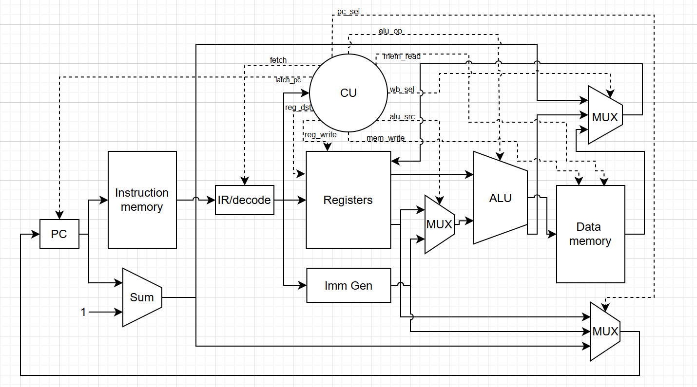
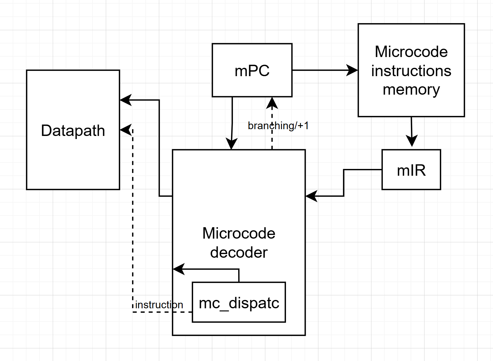

# LIRC — Lisp-based Instruction RISC Computer

**Вариант:** `lisp | risc | harv | mc | tick | binary | stream | mem | pstr | prob1` — без усложнения (pipeline)

Реализация состоит из трёх независимых стадий `lisp → asm → binary → execution`:

- `src/translator` — транслятор Lisp-подобного языка в ассемблер
- `src/assembler` — ассемблер, переводящий текстовый `.asm` в машинный код
- `src/emulator` — потактовый эмулятор процессора 

---

## Язык программирования

### Синтаксис

Программа — последовательность S-выражений. Любое выражение — это литерал, переменная или список в круглых скобках, первый элемент которого определяет форму.

    program  ::= { expr }

    expr     ::= NUM_LIT | STR_LIT | VAR_LIT | "(" form ")"

    form     ::= if_form
                | setq_form
                | defun_form
                | print_form
                | read_form
                | loop_form
                | op_form
                | var_ref_form
                | call_form

    if_form     ::= "if" expr expr expr
    setq_form   ::= "setq" VAR_LIT expr
    defun_form  ::= "defun" VAR_LIT "(" { VAR_LIT } ")" expr { expr }
    print_form  ::= "print" expr
    read_form   ::= "read"
    loop_form   ::= "loop" "for" VAR_LIT "from" expr "to" expr "do" expr { expr }
    op_form     ::= ("+" | "-" | "*" | "/" | "=" | "/=" | "<" | ">") { expr }
    var_ref_form::= VAR_LIT                      ; "(x)" — обращение к переменной x
    call_form   ::= VAR_LIT { expr }             ; "(f a b)" — вызов функции f

    NUM_LIT ::= ["-"] DIGIT { DIGIT }
    STR_LIT ::= '"' { любой символ кроме '"' } '"'
    VAR_LIT ::= (ALPHA | "_") { ALPHA | DIGIT | "_" | "-" }

Лексер (`src/translator/tokenizer.py`) построен на наборе функций-правил: каждому токену соответствует либо ключевое слово, либо функция разбора. Комментарии — однострочные, начинаются с `;` и вырезаются на препроцессинге.

Парсер (`src/translator/ast_parser.py`) — рекурентный разбор по одному токену. Перед основным проходом выполняется `pre_scan_functions` — regex-проход по исходнику, который заранее регистрирует имена всех `defun`, чтобы поддержать прямые (forward) вызовы функций, объявленных позже места использования.

### Семантика

- Результат любого выражения попадает в `$v0`.
- Запись префиксная (S-выражения): `(+ a b)`, `(if cond then else)`.
- Переменные и функции — глобальные, видны везде; память выделяется при первом использовании.
- Функции (`defun`) поддерживают рекурсию, аргументы передаются через стек.
- Типизация слабая: всё — 32-битное слово.
- Строки — Pascal-строки (длина + посимвольно), хранятся в `.data`.
- `(read)` читает строку ввода до `\n` через memory-mapped порты, возвращает адрес буфера.
- `loop for v from a to b do ...` — числовой цикл с проверкой через `SLT`/`BNE`.
- В бинарных операциях левый операнд считается первым и кладётся в стек, затем правый, затем выполняется АЛУ-операция.
- Трансляция в два прохода: токенизация + AST, затем генерация ассемблера с вычислением адресов и меток.

---

## Организация памяти

### Архитектура: Гарвардская

Память команд и память данных физически и адресно разделены:

- **Память команд** — список 32-битных машинных слов (`InstructionMemory`).
- **Память данных** — словарь `адрес → значение` (`DataMemory`), хранит переменные, константы, строки, буферы чтения и стек.

### Регистры

32 регистра общего назначения по 32 бита (`$0`..`$31`), часть из них имеет мнемонические имена (`src/config.py`):

| Имя     | №  | Назначение                                            |
|---------|----|--------------------------------------------------------|
| `$zero` | 0  | всегда хранит 0 (по соглашению, аппаратно не защищён)  |
| `$v0`   | 2  | «аккумулятор» — значение последнего вычисленного выражения, возвращаемое значение функции |
| `$v1`   | 3  | вспомогательный регистр результата                     |
| `$a0`   | 4  | аргумент для `PRINTS` / `OUTNUM`                       |
| `$a1`   | 5  | вспомогательный регистр-аргумент                       |
| `$t0`–`$t5` | 8–13 | временные регистры (промежуточные вычисления)     |
| `$gp`   | 28 | базовый адрес сегмента глобальных переменных (`= 0`)   |
| `$sp`   | 29 | указатель стека                                         |
| `$ra`   | 31 | адрес возврата из функции                               |

Также допускается прямая числовая адресация регистров (`$0`..`$31`).

### Способ адресации

Единственный режим адресации операндов памяти — **база + смещение**: `LW/SW $rt, imm($rs)`, где эффективный адрес равен `$rs + imm`. 

---

## Система команд

Система команд — RISC

Размер машинного слова — 32 бита, размер инструкции — одно слово.

### Форматы команд

**R-тип** (`ADD`, `SUB`, `MUL`, `DIV`, `SLT`, `JR`) — регистровые операции:

    31     26 25   21 20   16 15   11 10      6 5      0
    +--------+-------+-------+-------+----------+-------+
    | opcode |  rs   |  rt   |  rd   | (не исп.)| funct |
    +--------+-------+-------+-------+----------+-------+

**I-тип** (`ADDI`, `LW`, `SW`, `BEQ`, `BNE`, `PRINTS`, `OUTNUM`) — операции с непосредственным операндом / память / переходы:

    31     26 25   21 20   16 15                       0
    +--------+-------+-------+----------------------------+
    | opcode |  rs   |  rt   |     immediate (знаковое)    |
    +--------+-------+-------+----------------------------+

Для `PRINTS`/`OUTNUM` используется только поле `rs`, `rt` и `imm` равны нулю.

**J-тип** (`J`, `JAL`) — безусловный переход:

    31     26 25                                         0
    +--------+----------------------------------------------+
    |  opcode |              address (индекс инструкции)     |
    +--------+----------------------------------------------+

**HALT** — однословная команда, значимы только биты опкода, остальное — нули.

### Таблица опкодов

| Мнемоника | Opcode (top, 6 бит) | Funct (для R-типа) | Формат | Описание |
|-----------|---------------------|--------------------|--------|----------|
| `ADD`     | `0x00` | `0x20` | R | `rd = rs + rt` |
| `SUB`     | `0x00` | `0x22` | R | `rd = rs - rt` |
| `SLT`     | `0x00` | `0x2A` | R | `rd = (rs < rt) ? 1 : 0` |
| `JR`      | `0x00` | `0x08` | R | `PC = rs` |
| `MUL`     | `0x1C` | `0x02` | R | `rd = rs * rt` |
| `DIV`     | `0x00` | `0x1A` | R | `rd = rs / rt` (целочисленное деление) |
| `ADDI`    | `0x08` | — | I | `rt = rs + imm` |
| `LW`      | `0x23` | — | I | `rt = MEM[rs + imm]` |
| `SW`      | `0x2B` | — | I | `MEM[rs + imm] = rt` |
| `BEQ`     | `0x04` | — | I | `if rs == rt: PC = PC + 1 + imm` |
| `BNE`     | `0x05` | — | I | `if rs != rt: PC = PC + 1 + imm` |
| `PRINTS`  | `0x30` | — | I | вывод Pascal-строки по адресу `rs` |
| `OUTNUM`  | `0x31` | — | I | вывод числа из `rs` в десятичном виде |
| `J`       | `0x02` | — | J | `PC = addr` |
| `JAL`     | `0x03` | — | J | `$ra = PC + 1; PC = addr` |
| `HALT`    | `0x3F` | — | — | останов процессора |
| `NOP`     | — | — | — | пустая операция (значение по умолчанию при нераспознанном коде) |

### Команды ввода-вывода

- `PRINTS $rs` — выводит Pascal-строку по адресу `$rs` (длина в первом слове, затем символы) в порт `OUT` (`0x00007F00`), повторяя себя до конца строки.
- `OUTNUM $rs` — выводит десятичное представление числа из `$rs` в `OUT`, заканчивая `\n`.
- `(read)` — через порты `IN_CTRL` (`0x00007F04`) и `IN` (`0x00007F08`) читает символы до `\n`, возвращает адрес буфера.

---

## Транслятор

Расположение: `src/translator/` (`tokenizer.py`, `ast_parser.py`, `translator.py`, `main.py`).

### Запуск

    python -m src.translator.main <input.lisp> <output.asm>

### Этапы работы

1. **Препроцессинг** — построчное вырезание комментариев (`; ...`).
2. **Токенизация** (`Tokenizer`) — посимвольное чтение исходника, распределение по правилам `TokenType` (ключевые слова, символы операций, числа, строки, идентификаторы, пробелы), отслеживание номера строки для диагностики ошибок.
3. **Построение AST** (`Parser`):
4. **Генерация ассемблера**:
   - отделяет `defun` от основного кода;
   - создаёт `main:` (установка `$sp`, `$gp`), затем код выражений, `HALT`, затем функции (`fn_...`);
   - генерирует уникальные метки для `if`, `loop` и сравнений (`=`, `/=`);
   - константы вне диапазона `-32768…32767` помещает в `.data` как `.word`;
   - строки — в `.data` как `.pascal`;
   - на выходе — текст ассемблера с секциями `.text` и `.data`.

---

## Ассемблер

Расположение: `src/assembler/` (`parser.py`, `main.py`), система команд — `src/isa.py`.

### Запуск

    python -m src.assembler.main <input.asm> <output_prefix>

---

## Модель процессора

Расположение: `src/emulator/` (`elements.py`, `datapath.py`, `microcode.py`, `cu.py`, `main.py`).

### Запуск

    python -m src.emulator.main <text.bin> <data.bin> <input.txt> <output.txt> [log.txt]

### DataPath

### ControlUnit 

---

## Тестирование

### Структура

- `examples/*.lisp` — исходные программы на целевом языке.
- `golden/*.yaml` — golden-тесты: исходный код, входные данные, ожидаемый ассемблер, дизассемблированный листинг, бинарные файлы, вывод программы и фрагмент потактового журнала.
- `tests/run_chain.py` — прогоняет `lisp → asm → bin → emulation` для одного примера и возвращает все промежуточные артефакты.
- `tests/expand_golden.py` — пересобирает golden-файлы по актуальной реализации.
- `tests/test_integration.py` — интеграционные тесты, сверяющие вывод эмулятора с `expected_output` из golden-файлов.
- `tests/conftest.py` — добавляет корень проекта в `sys.path` для импорта `src.*` в тестах.

### Запуск тестов

    pytest -v tests/test_integration.py

## CI
 
GitHub Actions (`.github/workflows/ci.yml`) на каждый push/PR запускает `ruff check`, `mypy src` и `pytest`. Те же проверки локально:
 
    poetry run ruff check .
    poetry run mypy src
    poetry run pytest -m "not slow"
    poetry run pytest -m slow   # долгие тесты (prob1)
